<p align="center"></p>

<h1 align="center">Dipper</h1>

**Find urban stream pollution at its source.** Citizens see sewage first. Dipper turns their reports into a
search that finds the polluting pipe in a few checks. It tells the public what is known, and hands the case to
utilities and health systems in FHIR.

Built for the OneAquaHealth IEEE Global Hackathon 2026. Primary track: 3, AI-Supported Assessment. Also
covers track 7, FHIR, and track 6.

> **Data honesty.** The stream geometry, culverts and nearby places (OpenStreetMap) are real, and so is the
> weather (Open-Meteo). The demo's candidate outfalls, citizen reports and check results are **simulated**
> and labelled that way on screen. SourceBench is a **simulation**. See [DATA.md](DATA.md).

**Why "Dipper"?** The white-throated dipper is a small songbird of fast, clean streams
and walks underwater to feed. Ecologists use it as a living indicator of stream health. The logo is a dipper
shaped like a map pin, dipping into the water: a clean-stream sentinel that points to where the pollution
enters.

| Citizen report (phone) | Nearby mission after reporting |
|---|---|
| 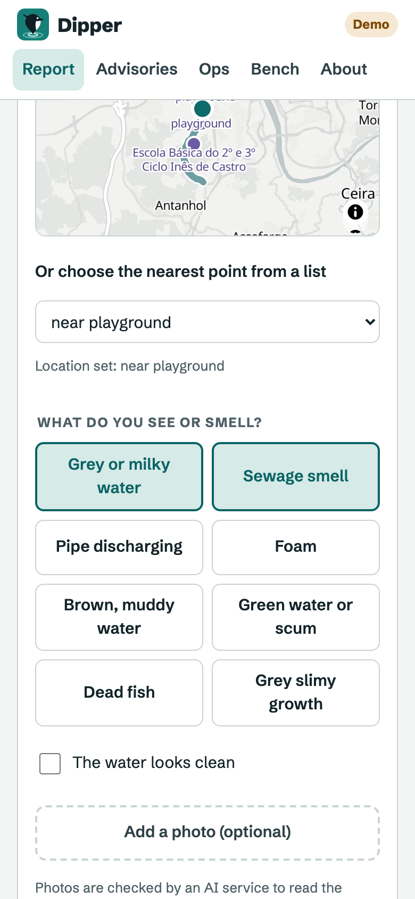 | 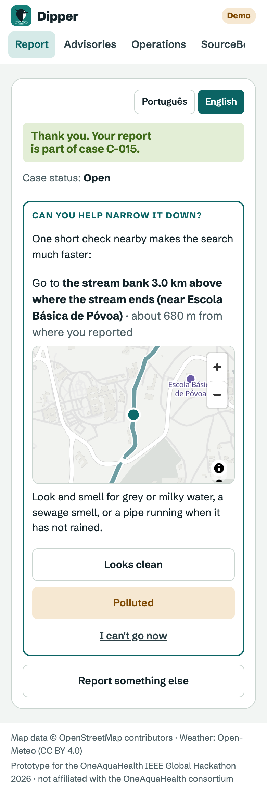 |

**Investigator workspace.** The probability of pollution is shaded along the real stream. Beside it are the
candidate entry points and the ranked next checks, each with both outcomes spelled out.

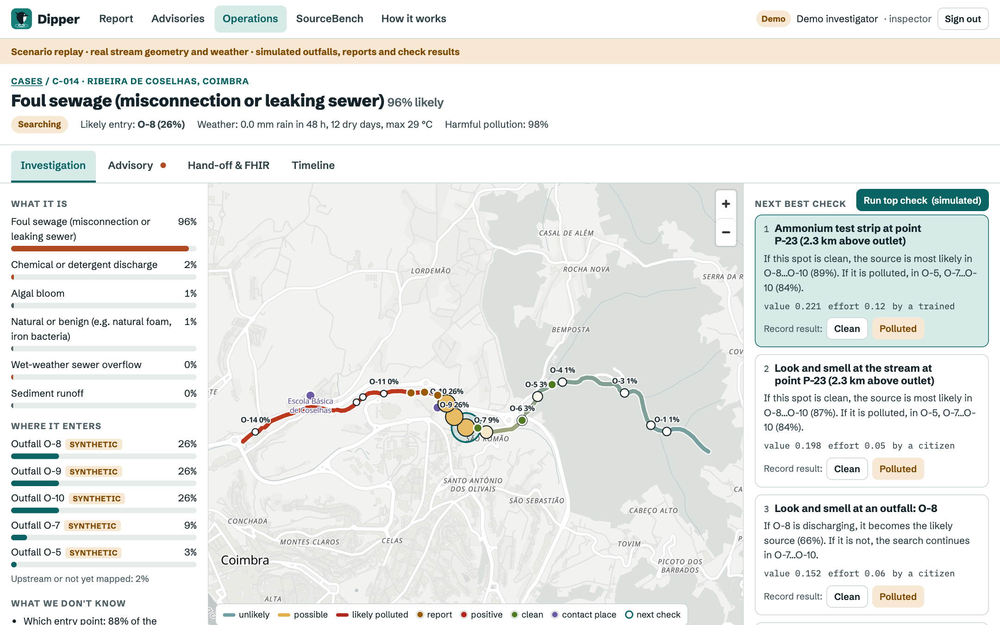

| Source localized | Advisory for public-health approval |
|---|---|
| 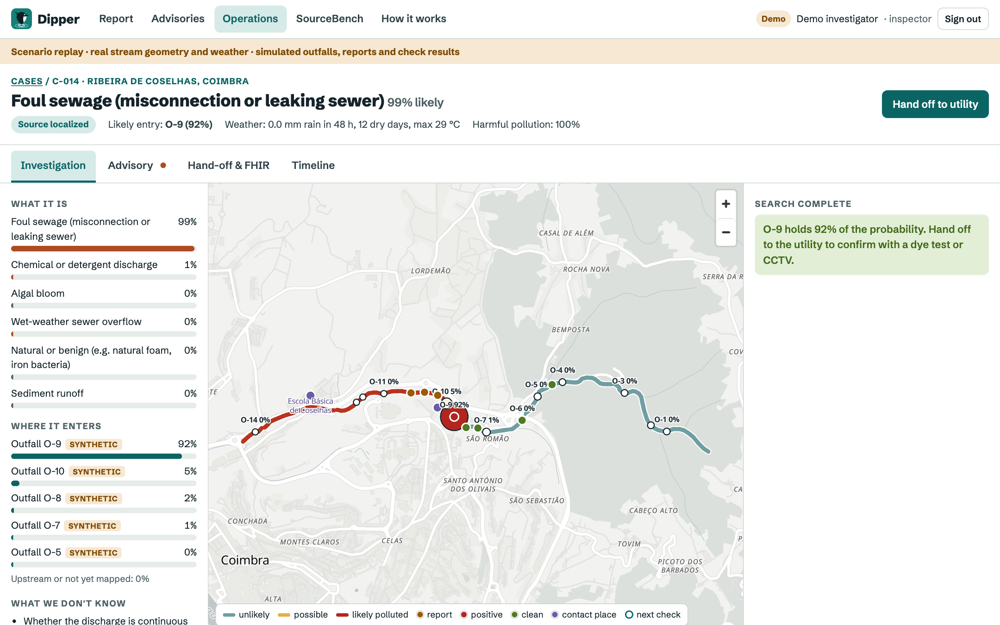 | 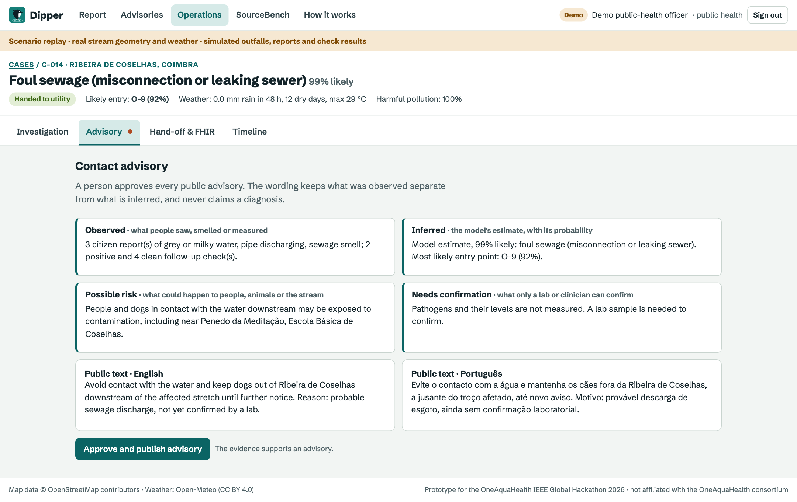 |
| **Hand-off and FHIR** | **Public advisory map** |
| 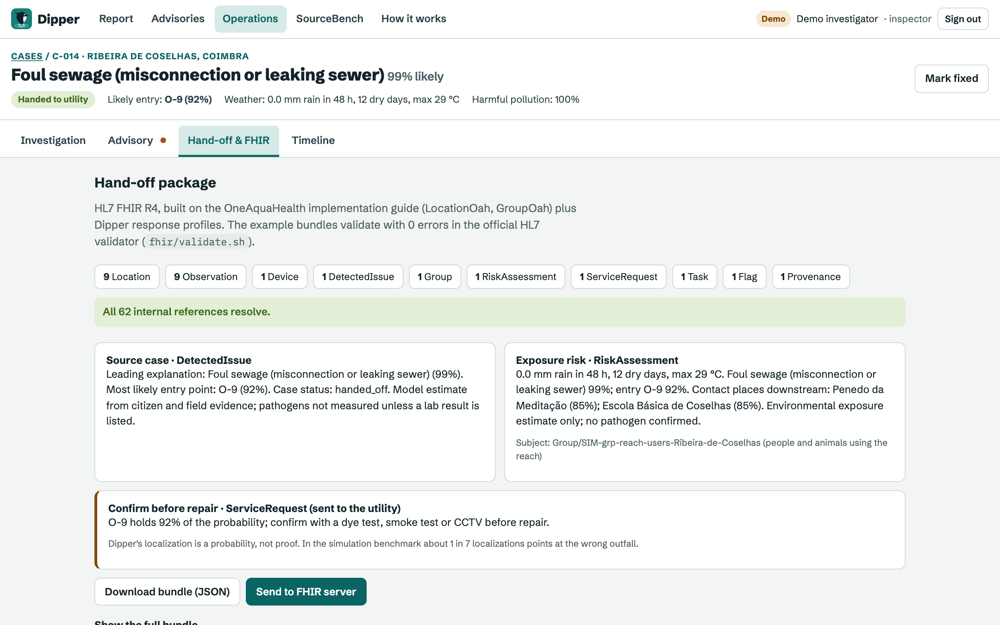 | 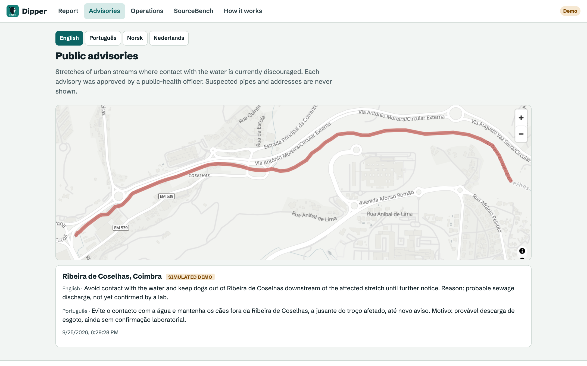 |

## The problem

Urban streams are polluted by sewage that should never reach them:
- **Misconnected plumbing:** a washing machine or toilet piped into the surface-water drain.
- **Leaking sewers.**
- **Overflows after rain.**

In the UK alone, an estimated 150,000 to 500,000 homes have a misconnection
([CIWEM](https://www.ciwem.org/news/drain-misconnections)).

The hard part is not knowing that a stream is dirty. It is finding **which pipe** is responsible. A stream
has dozens of outfalls, many discharges are intermittent, and field teams walk the bank outfall by outfall.
Meanwhile the people who notice first (walkers, dog owners, schools) report into a void and never hear back.

This matters more from now on. The recast EU Urban Wastewater Treatment Directive
([2024/3019](https://eur-lex.europa.eu/eli/dir/2024/3019/oj/eng)) requires integrated urban wastewater
management plans for all agglomerations of 100,000 p.e. and above by 2033. Those plans must cover storm
overflows and urban runoff. Every such city needs a way to turn scattered signals into located sources.

## What Dipper does

| Who | What they get |
|---|---|
| **Citizen** (phone, in the city's language and English, works offline) | Reports what they see or smell in under a minute. Gets one short, nearby "mission" that sharpens the search, and sees what their check changed. |
| **Investigator** (utility or municipality) | A case with a probability for each explanation and each candidate outfall. Gets the next best check with both outcomes spelled out, and hands off once the source is localized. |
| **Public-health officer** | A drafted advisory that keeps what was *observed* separate from what is *inferred*. They approve it, and it goes onto a public map. |
| **Health information systems** | A FHIR R4 bundle on the OneAquaHealth IG (0 validator errors), pushed to any FHIR server. |

End to end: **report → case → next best check → source localized → hand-off (FHIR) → advisory → fix verified.**

## How it works

1. **Reports become evidence.** Each report is snapped to a stream network built from OpenStreetMap. The
   network has flow direction, culverts and bridged gaps.
2. **Belief over what and where.** An exact joint probability covers six explanations (foul sewage, overflow,
   chemical, sediment, bloom, benign) and every candidate entry point. Weather sets the priors: dry weather
   favours misconnections, rain favours overflows.
3. **Clean results count.** A clean look at the stream lowers the probability of every source upstream of
   it. Intermittent discharges are modelled, so a clean check lowers a probability but never rules a source out.
4. **Next best check.** Every possible check at every location is scored on value of information:

   `EVSI for the advisory decision + 1.2 × bits of source entropy removed − cost − delay`

   The possible checks are a citizen look, an outfall look, an ammonium strip and a lab sample. For
   citizens, the score is also charged for the walk from where they reported.
5. **Photos help, people decide.** A photo is redacted on the server first: EXIF (including GPS) is removed
   and faces are blurred. Only then does a vision model read visual indicators. The model is Claude
   (`claude-opus-5`) or Gemini (`gemini-flash-latest`). The photo counts as a separate, weaker observer. If it
   disagrees with the citizen, the citizen is asked; their answer is never overwritten.
6. **People approve.** Advisories, hand-offs and dismissals need a signed-in person with the right role.
   Every change to the belief is explained in an evidence ledger, and every decision is kept in an audit trail.

## Architecture

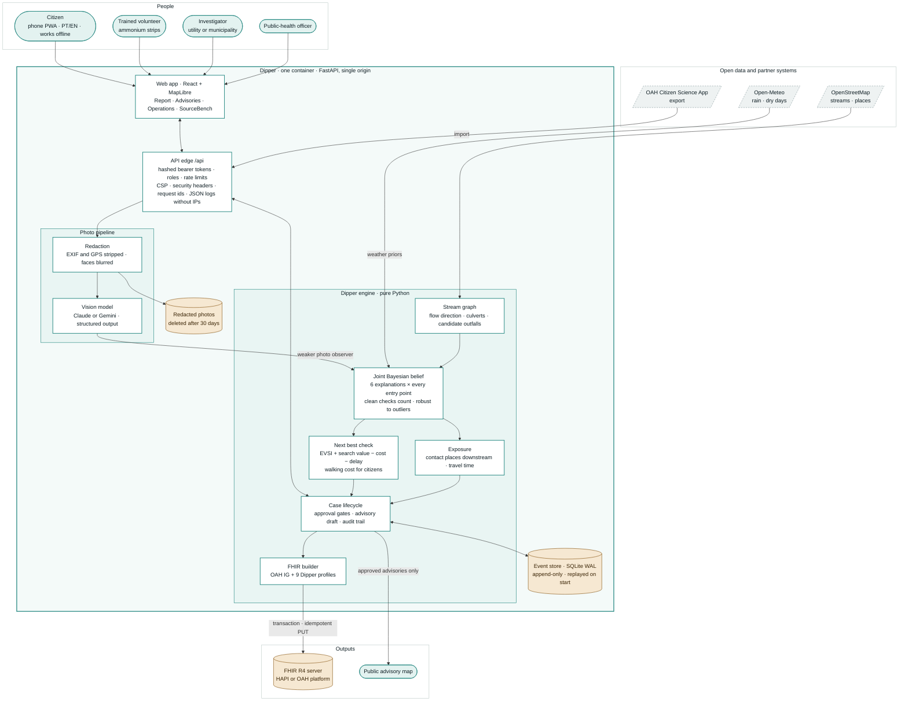

**Case lifecycle.** Every transition needs a signed-in person with the right role. A fix counts as verified
only after a clean follow-up check.

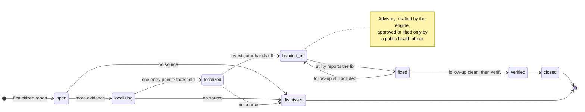

**From one report to a hand-off:**

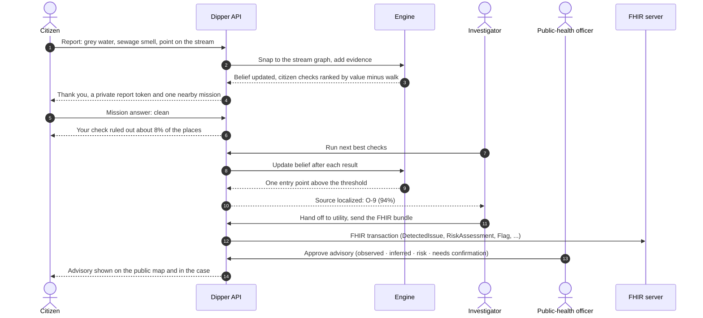

## Quickstart

```bash
docker compose up --build        # web app and API on http://localhost:8000 (demo mode on)
```

Open http://localhost:8000 and choose **Operations → Continue as investigator → Replay 18 Sep 2026**. Then
press **Run top check** until the source is localized. Hand off, sign in as a public-health officer and
approve the advisory. Last, open **Advisories**. The citizen flow is at **Report**.

Development without Docker:

```bash
uv sync && uv run pytest                                           # 79 tests
DIPPER_DEMO=1 uv run uvicorn dipper_api.main:app --reload          # API at :8000, docs at /docs (demo only)
npm --prefix web install && npm --prefix web run dev               # UI at http://localhost:3000
uv run python -m dipper_engine.sim --trials 40                     # SourceBench (simulation)
uv run python scripts/export_fhir_examples.py && ./fhir/validate.sh  # FHIR bundles + HL7 validator
npm --prefix web run a11y -- http://localhost:8000                 # axe audit (needs a demo site and Chrome)
```

`docker compose --profile fhir up` also starts a local HAPI FHIR server, reachable from the app at
`FHIR_BASE_URL=http://hapi:8080/fhir`.

## Production deployment

One container serves the web app at `/` and the API at `/api` (`dipper_api.main:site`). It runs as a non-root
user, has a health check on `/api/ready`, and keeps all state in the `/app/state` volume.

| Variable | Purpose |
|---|---|
| `DIPPER_DEMO` | `1` enables scenario replay and one-click demo sign-in (investigator or public-health officer, never admin). **Set `0` in production.** |
| `DIPPER_DB`, `DIPPER_MEDIA`, `DIPPER_CACHE` | Event store, redacted photos and downloaded weather (default: under `/app/state`) |
| `DIPPER_MEDIA_DAYS` | Photo retention in days (default 30), enforced at startup and every hour |
| `DIPPER_PEPPER` | Secret for pseudonymising citizen device ids. Generated and stored on first run if unset. |
| `DIPPER_PROXY_HOPS` | Number of reverse proxies in front of the app, so rate limits see the real client |
| `ANTHROPIC_API_KEY` or `GEMINI_API_KEY`, `DIPPER_VISION_PROVIDER` | Photo reading (optional; reports work without it) |
| `FHIR_BASE_URL`, `FHIR_TOKEN` | FHIR server for case hand-off |
| `PORT` | Listening port (default 8000) |

Staff accounts are created by an administrator. The token is shown once, stored only as a hash, and expires
after 90 days unless set otherwise. A lost or leaked token is revoked at once:

```bash
docker compose exec app python -m dipper_api.admin create-user --name "A. Inspector" --role inspector
docker compose exec app python -m dipper_api.admin list-users
docker compose exec app python -m dipper_api.admin revoke-user --id u_0123456789ab
```

The roles are `trained` (volunteer checks), `inspector` (investigation and hand-off), `public_health`
(advisories) and `admin`.

**Security and privacy by design:**
- **Citizens are anonymous.** They are identified only by a random device id, which the server turns into a
  keyed pseudonym.
- **Only the reporter can follow a report.** Each report returns a private token, sent in a header and never
  in a URL. Only that token opens the case summary and answers its missions, once per mission. Case ids alone
  are guessable; the token is not.
- **A clean report is evidence, not a case.** "The water looks clean" becomes a clean look for an open case
  and never opens a pollution case by itself.
- **Minimal location sharing.** A mission is chosen from where the stored report was snapped to the stream,
  so the phone never sends its location again. Citizens never see the outfall ranking or outfall labels.
- **Photos:**
  - EXIF is stripped and faces are blurred before any model sees a photo.
  - If face detection is unavailable, the photo is discarded.
  - Stored photos are deleted after the retention period, checked every hour.
- **Staff decisions:** every decision records the person's role and id. FHIR exports carry role and id,
  never names.
- **Hardening:**
  - API docs and schema are served only in demo mode (or with `DIPPER_DOCS=1`).
  - HSTS only over HTTPS; the public weather endpoint is snapped to mapped streams and the last 60 days.
  - Rate limits on public endpoints, including mission answers. They hold behind a reverse proxy: forwarded
    addresses are trusted only from declared proxies (tested through the production `/api` mount).
  - Content Security Policy and security headers.
  - Request ids.
  - JSON logs without IP addresses.
  - Image decompression-bomb limits.
  - Strict input validation, with every state change validated before it is stored.
- **Audit and recovery:** the event store is append-only. On restart, the belief is rebuilt by replaying
  the evidence, and a malformed case is quarantined instead of blocking startup.

**Backups:** copy `/app/state` (the SQLite database in WAL mode, plus media). For example, with
`sqlite3 /app/state/dipper.sqlite3 ".backup /backup/dipper.sqlite3"`.

## Scaling

**The deployment unit is one city or one utility.** Streams are independent networks, so each city runs its
own container with its own reaches, staff and event store. There is no shared state between cities.

| What | Measured on a laptop (Apple silicon, one core) |
|---|---|
| Case view, first after new evidence (ranks every possible check) | 11 ms on Ribeira de Coselhas (156 stream points, 14 outfalls); 65 ms on Zwalmbeek, Ghent (1,524 points) |
| Case view afterwards (ranking cached until new evidence arrives) | 1.1 ms and 7.3 ms |
| A dense urban catchment: synthetic stream with 1,500 points and 300 outfalls | 0.6 s first view, 14 ms cached |

Page views far outnumber new evidence, so the cache carries almost all traffic. Ranking scores every check
with numbers only and writes explanations just for the checks shown, which made it about 3× faster with
byte-identical results.

**Cases run in parallel.** Each case has its own lock for its belief and ranking. A short global lock guards
only the case registry and database writes, and slow work (weather downloads, photo models) holds neither.
A test drives concurrent reports, missions and staff checks across streams, then replays the database and
gets the same posteriors.

**What breaks first, and the path past it:**
1. **One process per city.** SQLite in WAL mode has one writer, and cases, rate-limit counters and report
   ids live in the process. A city's load fits easily. For a national operator, the event store moves to
   Postgres (the schema is already append-only events) and cases are sharded by stream across workers,
   with shared rate limits.
2. **Very large outfall inventories.** Ranking grows with outfalls × stream points; beyond a few hundred
   outfalls per stream, prune candidates with negligible probability before ranking.
3. **Startup replay.** Every case is rebuilt from its events at start, which takes seconds for thousands of
   cases. Closed cases can be archived out of the hot set.

## Accessibility and usability

- **Automated checks:** axe-core (WCAG 2.2 AA and best practice) reports **0 violations** on every screen
  and case tab, at 1440, 375 and 320 px. It also checks for horizontal scrolling. Reproduce it with
  `npm --prefix web run a11y`; CI runs it on every push.
- **Keyboard and screen readers:**
  - Skip link, landmarks and one `h1` per screen.
  - Visible focus, and focus moves to the confirmation after a report.
  - A live region announces every result.
  - Every map has a text alternative. Citizens can pick their location from a list of named points instead
    of the map.
- **Mobile and offline:**
  - Mobile first, with no horizontal scrolling at 320 px.
  - Installs as a PWA. A report made offline keeps the time it was made, is sent automatically when the phone
    is back online, and is never counted twice. A photo cannot be queued offline, and the app says so.
- **Plain language:**
  - The citizen app is in English and each pilot city's language: Portuguese (Coimbra), Norwegian (Oslo) and
    Dutch (Ghent). It follows the browser's language and falls back to English for visitors. These are draft
    translations for native speakers to review before a pilot.
  - Numbers come with plain words ("your check ruled out about 8% of the places the source could be").
  - Advisories are drafted in English and the city's language. The public sees exactly the wording the
    officer approved.
  - Simulated data is always labelled.
- **Performance:** fonts are self-hosted and the map loads after the page, so the first view is about 90 kB
  of script (gzip).

## SourceBench results (SIMULATION)

**Setup:**
- 7 networks: 5 real OAH streams (Coimbra ×2, Oslo ×3) and 2 synthetic.
- 40 trials per network, with identical truths for every strategy.
- Budget of 25 checks.
- The simulated world is noisier than the model (`--misspec 1.3`), and its discharges come in bursts.

| Strategy | Localized correctly | Wrong localization | Median checks (successes) | Mean cost |
|---|---|---|---|---|
| Walk the bank, outfall by outfall | 28% | 7% | 20 | 1.49 |
| Bisect (look at the stream at the 50% point) | 43% | 11% | 13 | 0.95 |
| **Dipper (value of information)** | **56%** | 9% | 9.5 | 1.30 |
| Greedy information gain, ignoring cost | 74% | 10% | 8 | 4.92 |
| Random check | 6% | 0% | 10 | 4.76 |

**Reading:**
- Dipper roughly doubles the success rate of a bank walk, at lower cost.
- Pure information gain succeeds more often but spends about 3.8× more, mostly on lab samples.
- `search_weight` moves along this trade-off: a higher value is faster but costlier.

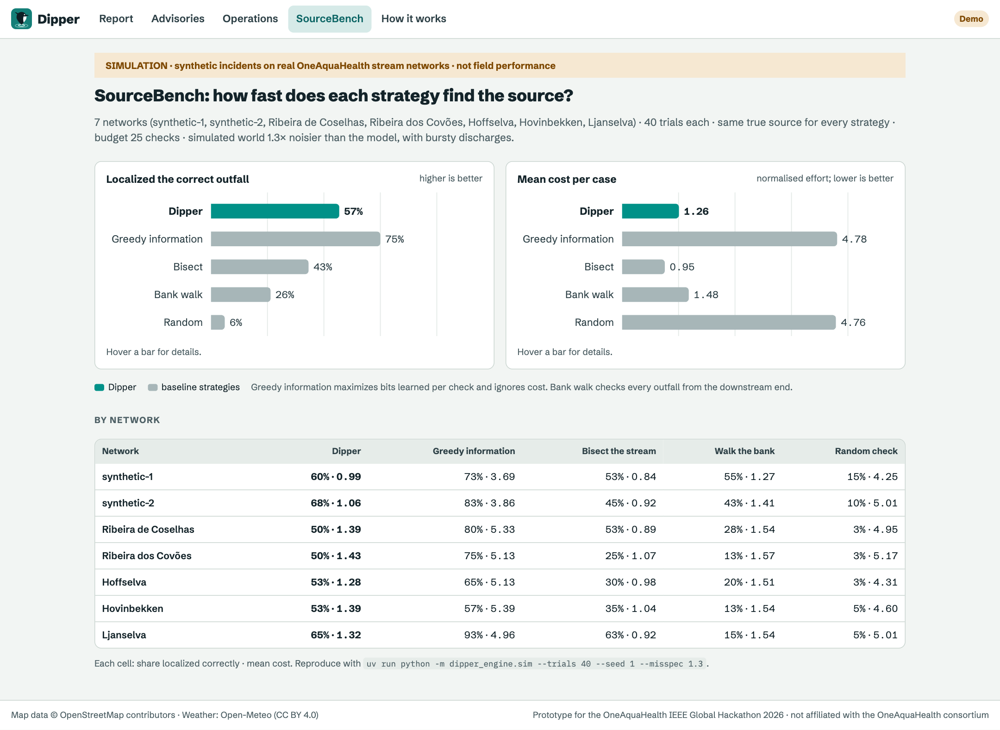

These are simulated results under stated assumptions, not field performance. Reproduce them with
`uv run python -m dipper_engine.sim --trials 40 --seed 1 --misspec 1.3`; the full output is in
`data/sourcebench/results.json`.

## FHIR

- **Profiles:** nine Dipper profiles sit on the OneAquaHealth IG (`LocationOah`, `GroupOah`):
  - citizen observation (Observation) and source case (DetectedIssue);
  - exposure risk (RiskAssessment) and site flag (Flag);
  - check request and confirmation request (ServiceRequest), and field task (Task);
  - advisory (Communication) and engine provenance (Provenance).
- **Confirm before repair:** a localized or handed-off case carries a confirmation request and task for the
  utility (dye test, smoke test or CCTV at the outfall). Localization is a probability: in SourceBench about 1
  in 7 localizations points at the wrong outfall.
- **Validation:** the example bundles validate with **0 errors** in the official HL7 validator (`fhir/validate.sh`,
  also run in CI).
- **The one warning:** the OAH cohort value set has only Age and Sex, while Dipper's cohort is defined by
  place, so Dipper uses its own code.
- **Push:** hand-off sends a transaction of `PUT`s with stable resource ids, so re-sending a case updates it
  instead of duplicating it.
- **Reproducible:** `fhir/validate.sh` pins the OAH IG commit and the validator release (6.10.4).

## Repository layout

```
src/dipper_engine/   model, stream graph, joint belief, value of information, exposure, case lifecycle,
                     FHIR export and push, photo redaction and vision, OAH import mapping, SourceBench
src/dipper_api/      FastAPI app (auth and roles, event store, retention, admin CLI), single-origin site
web/                 React + MapLibre PWA: citizen report, public advisories, operations, SourceBench
fhir/                Dipper FSH profiles on the OAH IG, example bundles, validator script
data/                real OSM reaches, weather cache, SourceBench results, photo evaluation
docs/model-card.md   every parameter and its rationale
```

## Status and limits

| Built and tested | Next, with a pilot partner |
|---|---|
| Engine, recommender, SourceBench, replay; 79 tests; CI | Real outfall inventories instead of synthetic candidates |
| Staff roles and approvals, audit trail, public advisories | Expert review of likelihoods; lab calibration |
| FHIR on the OAH IG, validated and pushed | Overflow-telemetry and sensor feeds as evidence |
| Photo pipeline, evaluated on 35 Commons photos ([data/eval](data/eval/README.md)) | Number-plate redaction; expert-labelled photo set |
| Accessible, offline-capable citizen PWA in four languages | Native review of translations; notifications when a case changes |

## Licence and attribution

Code: Apache-2.0. Map data © OpenStreetMap contributors (ODbL). Weather data by Open-Meteo (CC BY 4.0).
Not affiliated with or endorsed by the OneAquaHealth consortium.
